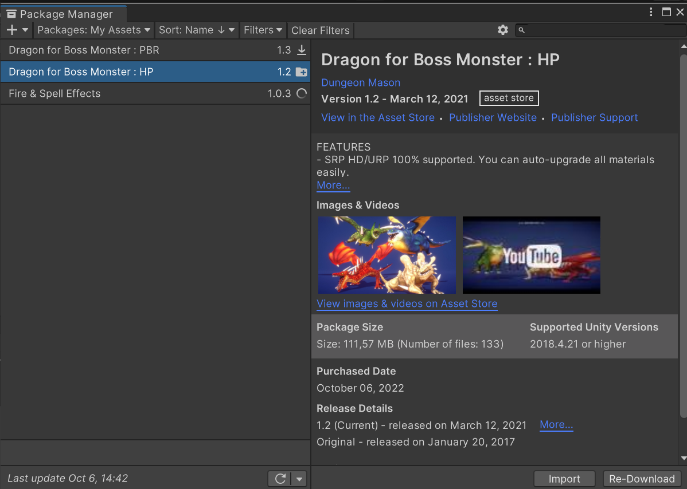
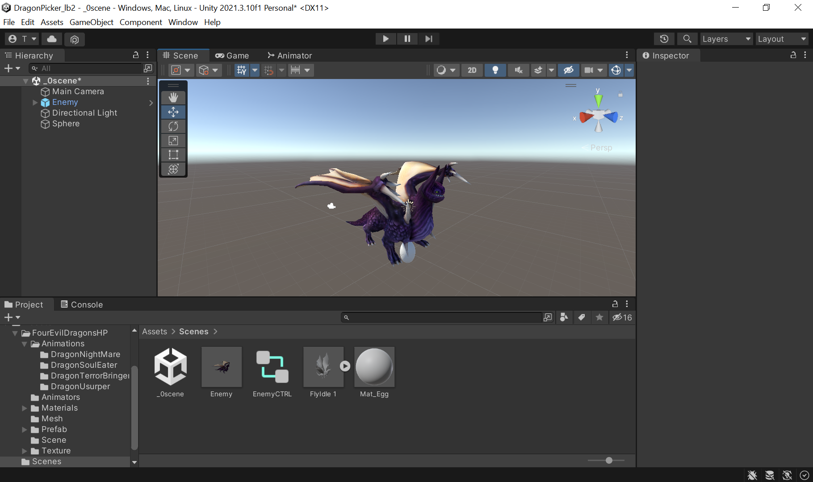
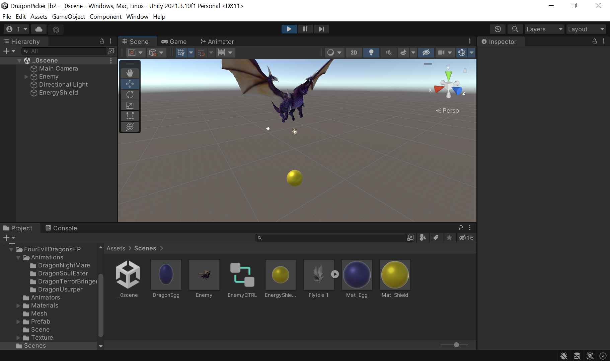
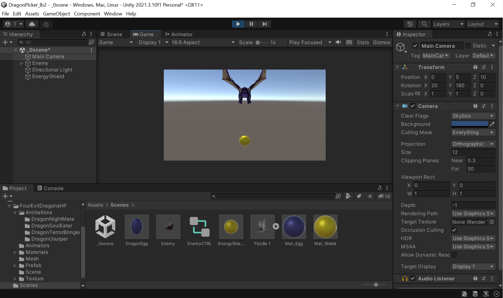
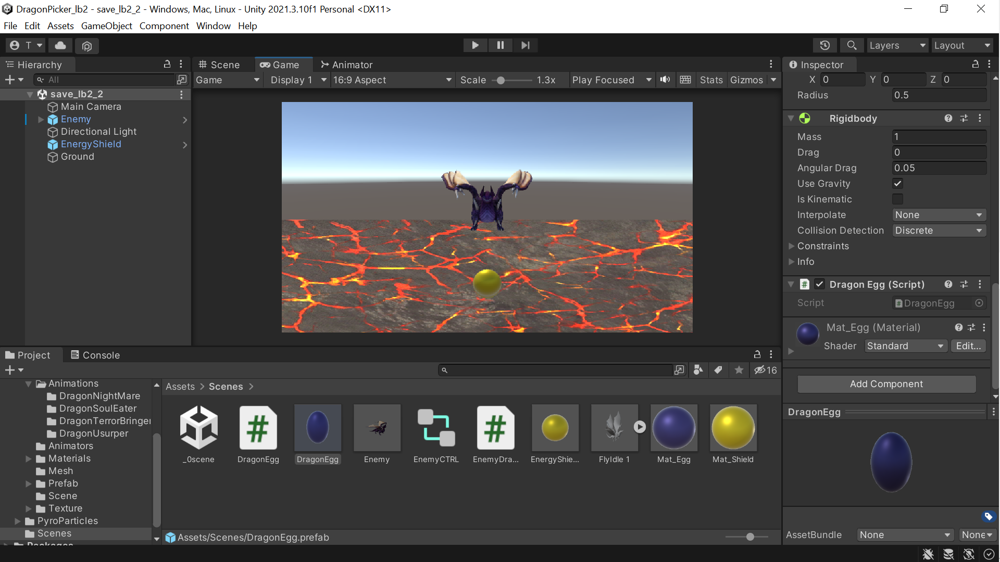
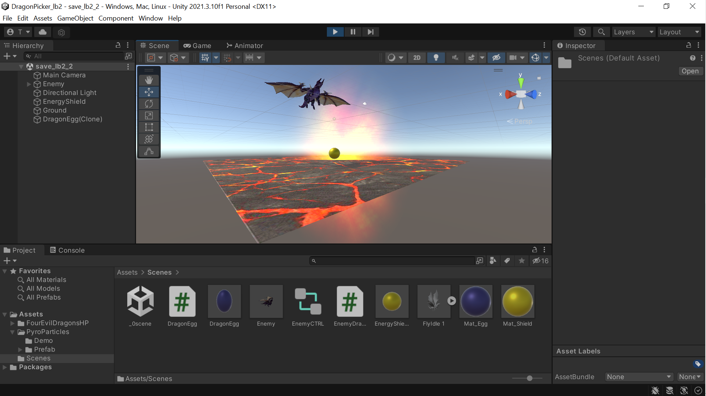
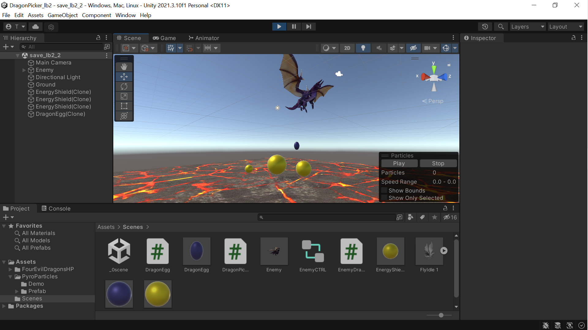

# Разработка игровых сервисов Лабораторная работа #2
Отчет по лабораторной работе #2 выполнил(а):
- Хафизова Анна Эдуардовна
- РИ300012
Отметка о выполнении заданий (заполняется студентом):

| Задание | Выполнение | Баллы |
| ------ | ------ | ------ |
| Задание 1 | * | 60 |
| Задание 2 | * | 20 |
| Задание 3 | * | 20 |

знак "*" - задание выполнено; знак "#" - задание не выполнено;

Работу проверили:
- к.т.н., доцент Денисов Д.В.
- к.э.н., доцент Панов М.А.
- ст. преп., Фадеев В.О.

[](https://nodesource.com/products/nsolid)

[](https://travis-ci.org/joemccann/dillinger)

Структура отчета

- Данные о работе: название работы, фио, группа, выполненные задания.
- Цель работы.
- Задание 1.
- Код реализации выполнения задания. Визуализация результатов выполнения (если применимо).
- Задание 2.
- Код реализации выполнения задания. Визуализация результатов выполнения (если применимо).
- Задание 3.
- Код реализации выполнения задания. Визуализация результатов выполнения (если применимо).
- Выводы.
- ✨Magic ✨

## Цель работы
Создание интерактивного приложения и изучение принципов интеграции в него игровых сервисов.


## Задание 1
### По теме видео практических работ 1-5 повторить реализацию игры на Unity. Привести описание выполненных действий.

Ход работы:

Повторяя действия лектора в видео, я открыла Packet Manager в Unity и скачала необходимые для выполнения данной лабораторной работы assets. (*Dragon for Boss Monster* для получения 3D моделей множества драконов и *Fire & Spell Effects для получения анимаций соприкосновения яиц и площадкой, текстуру для которой также получим из этого asset).



Далее я вытащила модельку дракона и выбрала ей понравившейся мне цвет. Соединила дракона с анимацией полёта. Создала внутриигровой объект яйцо по заданным параметрам и добавила для него материал, который в дальнейшем послужит для определения цвета всех вызванных яиц.


Также я создала объект энергетический щит и добавила для него материал цвета. На скриншоте можно заметить модельку дракона с раскрытыми крыльями, так как на данный момен тсцена запущена и он находится в полёте. Добавила префаб яйца.

Настроила камеру по множеству новых настроек, благодаря чему игроку будет удобнее следить за происходящими действиями.

Следующим кодом мы выставляем переменные, с помощью которых в методе *Update* мы задаём движение дракона, чтобы он не выходил за пределы нашего экрана.
```c#
public GameObject dragonEggPrefab;
public float speed = 1;
public float timeBetweenEggDrops = 1f;
public float leftRightDistance = 10f;
public float chanceDirection = 0.1f;
    

void Update()
{
    Vector3 pos = transform.position;
    pos.x += speed * Time.deltaTime;
    transform.position = pos;

    if (pos.x < -leftRightDistance){
        speed = Mathf.Abs(speed);  
    }
    else if (pos.x > leftRightDistance){
        speed = -Mathf.Abs(speed);
     }
}

```
С помощью кода ниже дракон будет менять траекторию его движение на противоположное со случайной вероятностью.
```c#
private void FixedUpdate() {
        if (Random.value < chanceDirection){
            speed *= -1;
        }
    }
```
Пишем метод *DropEgg*, благодаря которому наш дракон будет генерировать в себе по ходу своего движения яйца:
```c#
void DropEgg(){
        Vector3 myVector = new Vector3(0.0f, 5.0f, 0.0f);
        GameObject egg = Instantiate<GameObject>(dragonEggPrefab);
        egg.transform.position = transform.position + myVector;
        Invoke("DropEgg", timeBetweenEggDrops);
    }
```

Добавляем плоскость и окрашиваем её в цвет магмы из asset со спецэффектами. 

Далее написан код для яиц, благодаря которому у нас генерировались и уничтожались яйца при соприкосновении с добавленной выше платформой.
```c#
void OnTriggerEnter(Collider other)
    {
        ParticleSystem ps = GetComponent<ParticleSystem>();
        var em = ps.emission;
        em.enabled = true;

        Renderer rend;
        rend = GetComponent<Renderer>();
        rend.enabled = false;
    }

    void Update()
    {
        if (transform.position.y < bottomY){
            Destroy(this.gameObject);
        }
    }
```
Можно увидеть на скришоте ниже, что создаётся эффект взрыва в момент уничтожения яйца при его соприкосновении с платформой.


Далее мы пишем код, благодаря которому в дальнейшем у нас будет система трёх жизней, при потере каждой из которых наш энергетический щит будет уменьшаться в размере.
```c#
public GameObject energyShieldPrefab;
    public int numEnergyShield = 3;
    public float energyShieldBottomY = -6f;
    public float energyShieldRadius = 1.5f;
    
    void Start()
    {
        for (int i = 1; i <= numEnergyShield; i++){
            GameObject tShieldGo = Instantiate<GameObject>(energyShieldPrefab);
            tShieldGo.transform.position = new Vector3(0, energyShieldBottomY, 0);
            tShieldGo.transform.localScale = new Vector3(1*i, 1*i, 1*i);
        }
    }
```
На скриншоте можно заметить вызов трёх энергетических щитов разных размеров, значит код работает корректно.


Далее, следуя инструкциям в видео, я зашла на сайт Яндекс Игр для разработчиков и заполнила большинство необходимой информации и загрузила иконку с обложкой для игры:


## Задание 2
### В проект, выполненный в предыдущем задании, добавить систему проверки того, что SDK подключен (доступен в режиме онлайн и отвечает на запросы);
Я изменила тип проекта на *WebGL* (предварительно скачав данное расширение из интернета), и в файл index.html добавила следующий код, найденный в документации Яндекс SDK:
```html
<!-- Yandex Games SDK -->
    <script src="https://yandex.ru/games/sdk/v2"></script>
    <script>
    YaGames.init().then(ysdk => {
        Debug.log("Яндекс SDK подключён");
        window.ysdk = ysdk;
        });
    </script>
```
Как видно на скриншоте ниже, в консоль вывелось сообщение о том, что SDK подключён.


## Задание 3
### 1.	Произвести сравнительный анализ игровых сервисов Яндекс Игры и VK Game
Ссылку на реферат с сравнительным анализом игровых сервисов можно найти по ссылке ниже
https://github.com/Anna2Khafizova/GameService_lab2

## Выводы

В ходе лабораторной работе я научилась множеству новых вещей: скачиванию новых asset'ов, глобальной настройке игровой камеры, глубже познакомилась с двумя игровыми сервисами и провела их сравнительный анализ.

✨Magic ✨

| Plugin | README |
| ------ | ------ |
| GitHub | [https://github.com/Den1sovDm1triy/DA-in-GameDev-lab1] |
| Google Drive | [plugins/googledrive/README.md][PlGd] |


## Powered by

**BigDigital Team: Denisov | Fadeev | Panov**
